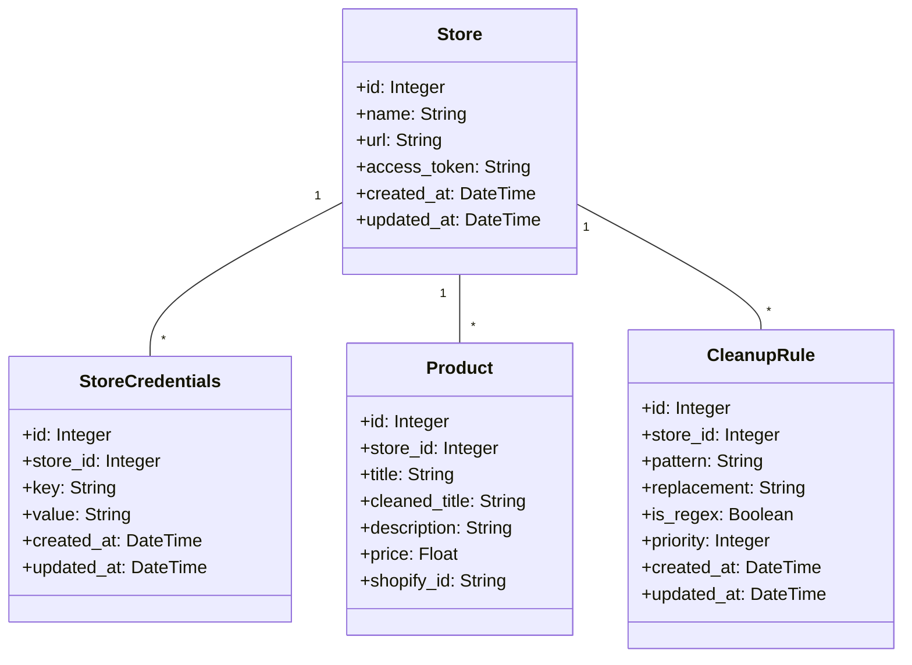

# Implementation Plan: Store Credentials and Product Name Cleanup

## Overview
This implementation plan addresses two main features:
1. Store-specific Shopify credentials management
2. Product name cleanup system with configurable rules

## Data Model Changes

## 1. Store Credentials Management

### New Model: StoreCredentials
- Fields:
  * id (Primary Key)
  * store_id (Foreign Key to Store)
  * key (e.g., 'shopify_access_token', 'shopify_api_key')
  * value (encrypted credential value)
  * created_at/updated_at timestamps

### UI Changes
- Add credentials section to store management page
- Create form for adding/editing store credentials
- Display current credentials with masked values
- Add validation for required credentials

### Integration Updates
- Modify Shopify integration to use store-specific credentials
- Update store creation/edit workflow
- Add credential validation on store operations
- Migrate existing env vars to store credentials

## 2. Product Name Cleanup System

### New Model: CleanupRule
- Fields:
  * id (Primary Key)
  * store_id (Foreign Key to Store)
  * pattern (text to match)
  * replacement (text to replace with)
  * is_regex (boolean)
  * priority (integer)
  * created_at/updated_at timestamps

### Product Model Updates
- Add cleaned_title field
- Add methods for title cleanup
- Update relevant queries to use cleaned_title

### Cleanup Service
- Create service to manage cleanup rules
- Implement rule application logic:
  * Apply rules in priority order
  * Support both exact match and regex patterns
  * Handle empty replacements (deletions)
  * Cache compiled regex patterns

### UI Implementation
- Create cleanup rules management page:
  * List existing rules
  * Add/edit/delete rules
  * Set rule priority
  * Test rules on sample text
- Add bulk cleanup action for existing products
- Show original/cleaned titles in product list
- Add cleanup preview in product forms

## Integration Points

### Product Import/Update
- Apply cleanup rules during Shopify import
- Update product edit form to show both titles
- Add bulk cleanup action for existing products

### Collection Creation
- Use cleaned titles for:
  * Collection names
  * Product listings
  * SEO content generation
  * Tag generation

### Tag System
- Use cleaned titles for tag generation
- Update tag management to show original/cleaned versions

## Migration Path

### Database Migrations
1. Create StoreCredentials table
2. Create CleanupRule table
3. Add cleaned_title to Products table
4. Add indexes for performance

### Data Migration
1. Move existing credentials to StoreCredentials
2. Add initial set of common cleanup rules:
   - "Final Sale!"
   - "Cannot Be Returned!"
   - Sale price patterns
   - Common promotional text
3. Run initial cleanup on existing products

### Deployment Steps
1. Run database migrations
2. Execute data migrations
3. Update application code
4. Deploy UI changes
5. Run cleanup on existing data

## Testing Plan
1. Unit tests for cleanup service
2. Integration tests for credential management
3. UI tests for new features
4. Migration testing with sample data
5. Performance testing for large datasets